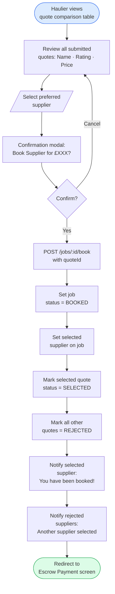
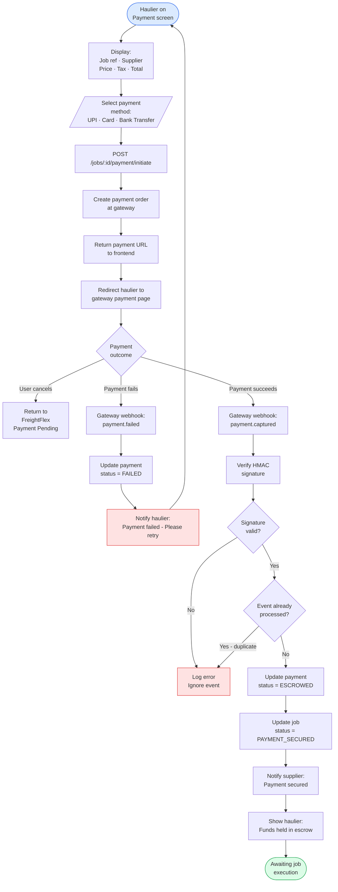
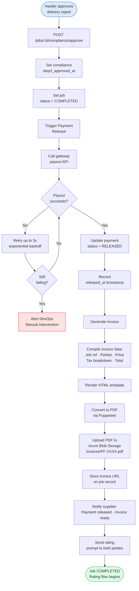
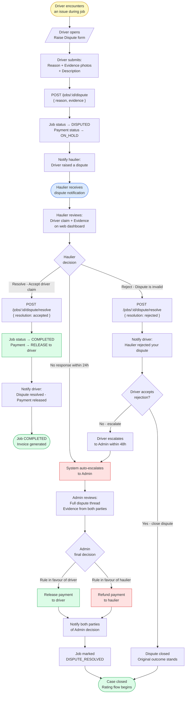
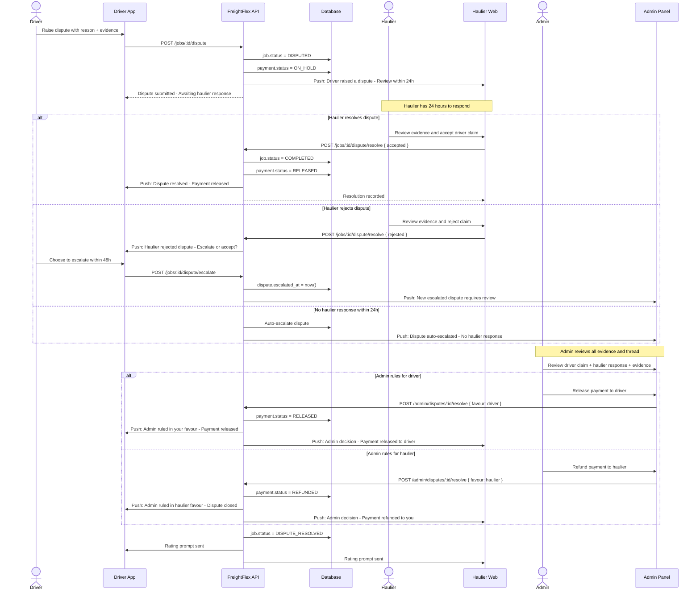

# Diagram 06 – Booking & Escrow Payment Flow

## 6A – Booking Confirmation Flow

## 6B – Escrow Payment Flow

## 6C – Payment Release & Invoice Flow

## 6D – Driver Dispute & Haulier Resolution Flow

## 6E – Dispute Escalation Sequence (Timeline View)

