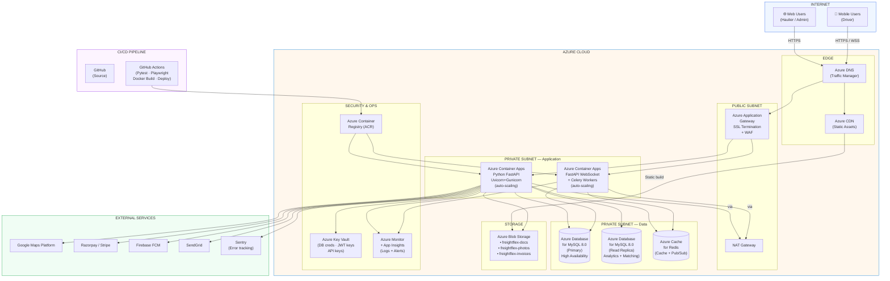
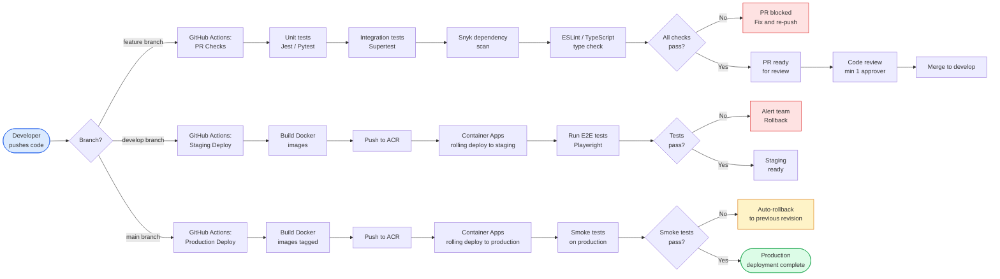
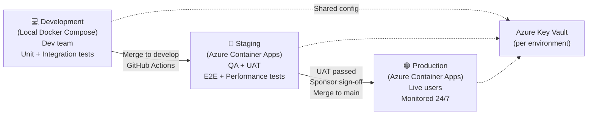

# Diagram 13 – Deployment & Infrastructure Diagram

## 13A – Cloud Infrastructure (Azure)

```mermaid
graph TB
    subgraph INTERNET["INTERNET"]
        USER_WEB["🌐 Web Users\n(Haulier / Admin)"]
        USER_MOB["📱 Mobile Users\n(Driver)"]
    end

    subgraph AZURE["AZURE CLOUD"]
        subgraph EDGE["EDGE"]
            CDN["Azure CDN\n(Static Assets)"]
            DNS["Azure DNS\n(Traffic Manager)"]
        end

        subgraph PUBLIC_SUBNET["PUBLIC SUBNET"]
            AGW["Azure Application\nGateway\nSSL Termination\n+ WAF"]
            NAT["NAT Gateway"]
        end

        subgraph PRIVATE_SUBNET_API["PRIVATE SUBNET — Application"]
            ACI_API["Azure Container Apps\nPython FastAPI\nUvicorn+Gunicorn\n(auto-scaling)"]
            ACI_WS["Azure Container Apps\nFastAPI WebSocket\n+ Celery Workers\n(auto-scaling)"]
        end

        subgraph PRIVATE_SUBNET_DATA["PRIVATE SUBNET — Data"]
            MYSQL_P[("Azure Database\nfor MySQL 8.0\n(Primary)\nHigh Availability")]
            MYSQL_R[("Azure Database\nfor MySQL 8.0\n(Read Replica)\nAnalytics + Matching)")]
            REDIS[("Azure Cache\nfor Redis\n(Cache + Pub/Sub)")]
        end

        subgraph STORAGE["STORAGE"]
            BLOB["Azure Blob Storage\n• freightflex-docs\n• freightflex-photos\n• freightflex-invoices"]
        end

        subgraph SECURITY["SECURITY & OPS"]
            KV["Azure Key Vault\n(DB creds · JWT keys\nAPI keys)"]
            MON["Azure Monitor\n+ App Insights\n(Logs + Alerts)"]
            ACR["Azure Container\nRegistry (ACR)"]
        end
    end

    subgraph EXTERNAL["EXTERNAL SERVICES"]
        MAPS["Google Maps Platform"]
        PGWY["Razorpay / Stripe"]
        FCM["Firebase FCM"]
        SG["SendGrid"]
        SENTRY["Sentry\n(Error tracking)"]
    end

    subgraph CICD["CI/CD PIPELINE"]
        GH["GitHub\n(Source)"]
        GHA["GitHub Actions\n(Pytest · Playwright\nDocker Build · Deploy)"]
        GHA --> ACR
        ACR --> ACI_API
        ACR --> ACI_WS
    end

    USER_WEB -->|HTTPS| DNS
    USER_MOB -->|HTTPS / WSS| DNS
    DNS --> CDN
    DNS --> AGW
    CDN -->|Static build| BLOB
    AGW --> ACI_API
    AGW --> ACI_WS

    ACI_API --> MYSQL_P
    ACI_API --> MYSQL_R
    ACI_API --> REDIS
    ACI_API --> BLOB
    ACI_API --> KV
    ACI_API --> MON

    ACI_WS --> REDIS
    ACI_WS --> MYSQL_P
    ACI_WS --> MON

    ACI_API --> MAPS
    ACI_API --> PGWY
    ACI_API --> FCM
    ACI_API --> SG
    ACI_API --> SENTRY

    ACI_API -->|via| NAT
    ACI_WS -->|via| NAT

    style AZURE fill:#FFF7ED,stroke:#0078D4
    style INTERNET fill:#EFF6FF,stroke:#2563EB
    style EXTERNAL fill:#F0FDF4,stroke:#16A34A
    style CICD fill:#FDF4FF,stroke:#9333EA
```

## 13B – CI/CD Pipeline Flow

```mermaid
flowchart LR
    A([Developer\npushes code]) --> B{Branch?}

    B -->|feature branch| C[GitHub Actions:\nPR Checks]
    C --> D[Unit tests\nJest / Pytest]
    D --> E[Integration tests\nSupertest]
    E --> F[Snyk dependency\nscan]
    F --> G[ESLint / TypeScript\ntype check]
    G --> H{All checks\npass?}
    H -->|No| I[PR blocked\nFix and re-push]
    H -->|Yes| J[PR ready\nfor review]
    J --> K[Code review\nmin 1 approver]
    K --> L[Merge to develop]

    B -->|develop branch| M[GitHub Actions:\nStaging Deploy]
    M --> N[Build Docker\nimages]
    N --> O[Push to ACR]
    O --> P[Container Apps\nrolling deploy to staging]
    P --> Q[Run E2E tests\nPlaywright]
    Q --> R{Tests\npass?}
    R -->|No| S[Alert team\nRollback]
    R -->|Yes| T[Staging\nready]

    B -->|main branch| U[GitHub Actions:\nProduction Deploy]
    U --> V[Build Docker\nimages tagged]
    V --> W[Push to ACR]
    W --> X[Container Apps\nrolling deploy to production]
    X --> Y[Smoke tests\non production]
    Y --> Z{Smoke tests\npass?}
    Z -->|No| AA[Auto-rollback\nto previous revision]
    Z -->|Yes| AB([Production\ndeployment complete])

    style A fill:#DBEAFE,stroke:#2563EB
    style AB fill:#DCFCE7,stroke:#16A34A
    style I fill:#FEE2E2,stroke:#DC2626
    style S fill:#FEE2E2,stroke:#DC2626
    style AA fill:#FEF3C7,stroke:#D97706
```

## 13C – Environment Promotion Flow

```mermaid
flowchart LR
    DEV["💻 Development\n(Local Docker Compose)\nDev team\nUnit + Integration tests"]
    STG["🔵 Staging\n(Azure Container Apps)\nQA + UAT\nE2E + Performance tests"]
    PROD["🟢 Production\n(Azure Container Apps)\nLive users\nMonitored 24/7"]

    DEV -->|Merge to develop\nGitHub Actions| STG
    STG -->|UAT passed\nSponsor sign-off\nMerge to main| PROD

    DEV -.->|Shared config| CONFIG["Azure Key Vault\n(per environment)"]
    STG -.-> CONFIG
    PROD -.-> CONFIG
```
